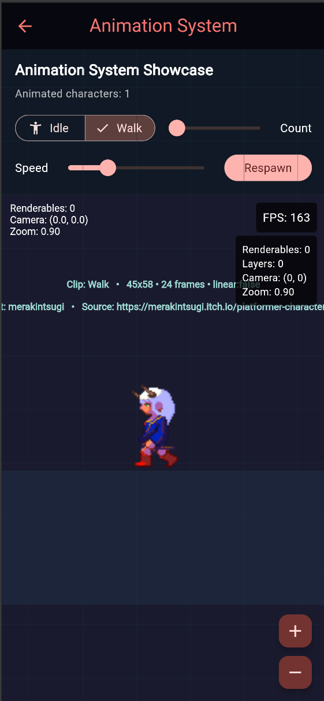
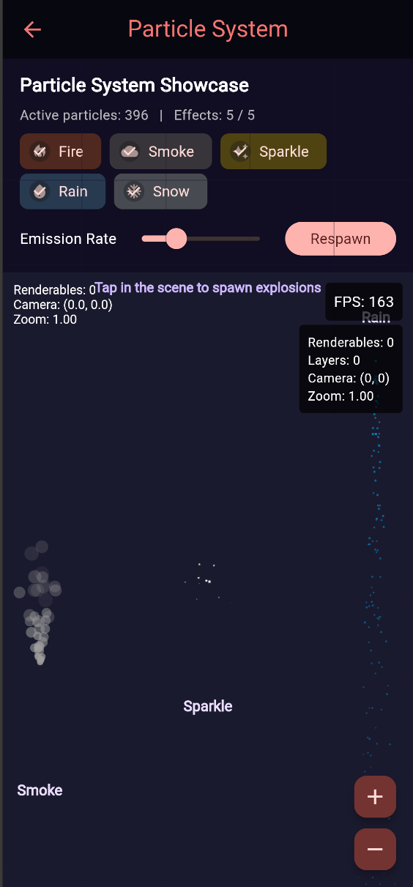
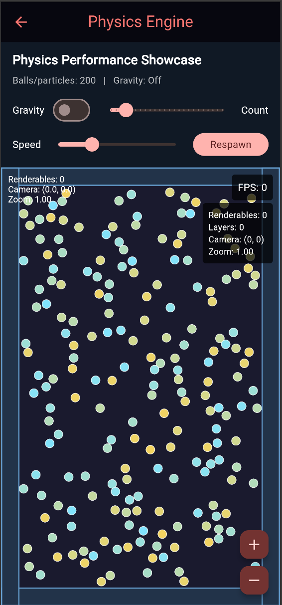
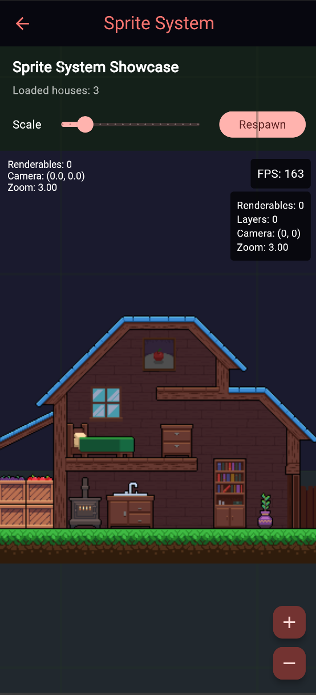
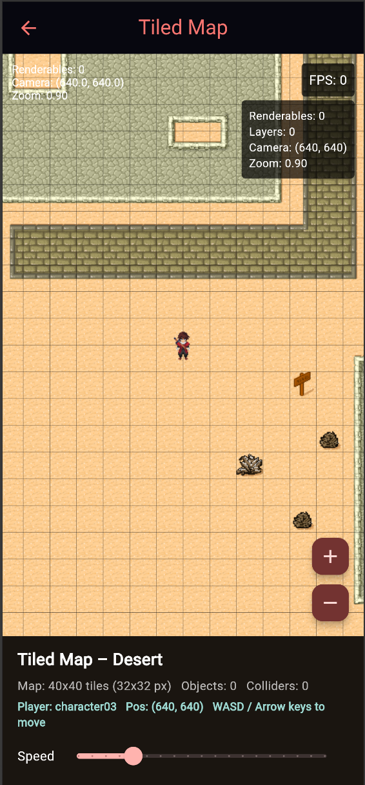

# Just Game Engine

A comprehensive 2D game engine built for Flutter, providing everything you need to create high-performance games with rich visual effects, animations, and physics.

## 📚 Documentation

- **[Quick Start Guide](QUICKSTART.md)** - Get started in 5 minutes
- **[API Reference](API.md)** - Detailed API documentation for all classes
- **[Documentation](https://engine.justunknown.com/docs/getting-started)** - Just Game Engine documentation.
- **[Discord](https://discord.gg/VXFxVj4Y)** - Join our community

## Screenshots

| | | | | |
|---|---|---|---|---|
|  |  |  |  |  |

## Features

Just Game Engine is a complete game development framework with 14 major subsystems:

### 🎮 Core Engine
- **Game Loop**: Fixed timestep (60 UPS) with variable rendering for consistent gameplay
- **State Management**: Full lifecycle management (initialize, start, pause, resume, stop)
- **Time Management**: Delta time, time scaling, FPS tracking
- **System Coordination**: Centralized management of all subsystems

### 🎨 Rendering Engine
- **2D Canvas-Based Rendering**: High-performance drawing with Flutter's Canvas API
- **Renderable Objects**: Circles, rectangles, lines, text, and custom renderables
- **Ray Renderable**: `RayRenderable` draws a glowing beam / laser / bullet trail with a two-layer glow effect and configurable fade lifetime
- **Camera System**: Pan, zoom, and rotation with smooth transforms
- **Layer Management**: Z-order sorting for proper depth rendering
- **Debug Visualization**: Bounding boxes, coordinate grids, and performance metrics
- **ECS Integration**: `GameWidget` automatically renders ECS entities via `RenderSystem` alongside the classic pipeline

### 🖼️ Sprite System
- **Image Rendering**: Load and display images with easy asset management
- **Sprite Sheets**: Efficiently manage multiple sprites in a single texture
- **Sprite Batching**: `SpriteBatch` submits all sprites sharing an atlas in a single `Canvas.drawAtlas()` call for dramatic draw-call reduction
- **Nine-Slice Scaling**: Scalable UI elements that maintain corner details
- **Flipping**: Horizontal and vertical sprite flipping

### ✨ Animation System
- **Sprite Animations**: Frame-based animations from sprite sheets with customizable frame rates
  - `SpriteAnimation` class for sprite sheet playback
  - `fromSpriteSheet()` factory for easy sprite animation creation
  - Independent frame count and duration per animation
  - Automatic frame calculation from sprite dimensions
- **Property Tweening**: Animate position, rotation, scale, opacity, and color
- **Easing Functions**: 15+ built-in easing curves (linear, quad, cubic, elastic, bounce, etc.)
- **Animation Sequences**: Chain animations to play one after another
- **Animation Groups**: Run multiple animations in parallel
- **Loop and Ping-Pong**: Repeat animations infinitely or bounce back and forth
- **Speed Control**: Adjust animation playback speed dynamically (0.1x - 5.0x)

### 💥 Particle Effects
- **Particle Emitters**: Configurable emission rate, lifetime, and spawning
- **Visual Properties**: Size gradients, color gradients, velocity, and gravity
- **Particle Shapes**: Circles, squares, and stars
- **Built-in Presets**: Explosion, fire, smoke, sparkle, rain, and snow effects
- **Custom Particles**: Create your own particle systems

### ⚛️ Physics Engine
- **Rigid Body Dynamics**: Semi-implicit Euler integration for reliable mass, drag, torque, and inertia simulation
- **Advanced Collision Shapes**: Circles, Rectangles, and arbitrary complex Polygons via SAT calculation
- **True Impulse Resolution**: Elastic collisions resolving linear constraints and Coulomb surface friction
- **Broad-Phase Optimization**: Performant $O(n)$ Spatial Grid queries with Object Sleeping features
- **Physics Caching**: Triangulation and expensive geometry processing can be reliably disk-cached

### 🔦 Ray Casting & Tracing
- **Ray**: 2D ray descriptor with origin, normalised direction, and max-distance; `Ray.fromPoints()` convenience constructor
- **RaycastColliderComponent**: ECS component marking an entity as hittable — configurable `radius`, `tag`, `isBlocker`, `isReflective`, and `reflectivity`
- **RaycastSystem**: Query-only ECS system — `castRay()` (closest hit), `castRayAll()` (all hits sorted nearest-first), and `hasLineOfSight()` for LOS checks
- **RayTracer**: Multi-bounce ray tracing against reflective surfaces — configurable `maxBounces` and `minReflectivity`; returns a `RayTrace` containing every path segment

### 🌳 Scene Graph
- **Hierarchical Structure**: Parent-child node relationships
- **Transform Propagation**: Automatic world-space transform calculation
- **Scene Management**: Create, load, and manage multiple scenes
- **Node Queries**: Find nodes by name or traverse the tree
- **Attachable Renderables**: Link visual objects to scene nodes

### 🗺️ Tiled Map Support (via `just_tiled`)
- **TMX / TSX Parsing**: Full support for Tiled map editor files — orthogonal, isometric, staggered, and hexagonal orientations
- **Tile Layers, Object Layers, Image Layers & Group Layers**: Complete layer hierarchy with custom properties
- **GPU-Batched Rendering**: `TileMapRenderer` uses `Canvas.drawRawAtlas` to submit all tiles in a single draw call for maximum throughput
- **Texture Atlas**: `TextureAtlas.fromTileMap()` builds a packed atlas from any loaded `TileMap`
- **Animated Tiles**: Per-tile animation sequences driven by the engine game loop
- **Spatial Hash Grid**: `SpatialHashGrid<T>` enables $O(1)$ AABB, point, and radius queries against map objects
- **Encodings & Compression**: CSV, Base64, and XML tile data; GZIP, Zlib, and Zstandard compression (via `just_zstd`)

### 🧩 Entity-Component System (ECS)
- **Data-Oriented Architecture**: Composition over inheritance for flexible entity design
- **Entity Management**: Create and destroy entities with generational IDs for use-after-destroy safety
- **Component System**: 24+ built-in components (Transform, Velocity, Physics, Health, RaycastCollider, UI, Audio, Tiled, etc.)
- **System Processing**: 14+ built-in systems with standardized priorities for movement, rendering, physics, input, audio, ray casting, and more
- **Query System**: Find entities by component types with selective cache invalidation and integer-based hashing
- **World Management**: Centralized entity and system coordination with `LinkedHashSet` for $O(1)$ entity removal
- **Command Buffer**: Deferred entity mutations via `world.commands` — safe to call from within system updates
- **Event Bus**: Typed inter-system messaging via `world.events` — subscribe with `on<T>()`, dispatch with `fire()`
- **Entity Prefabs**: Reusable entity blueprints via `EntityPrefab` — batch-spawn with `world.instantiate()`
- **Hierarchy Support**: Parent-child entity relationships
- **Reactive ECS** (`src/reactive/`): Signal-driven wrappers powered by `just_signals` — `ComponentSignal`, `EntitySignal`, `WorldSignal`, `ReactiveSystem`, and `ReactiveComponent` enable surgical UI updates without polling

### � Input Management
- **Keyboard Input**: Key press, hold, and release detection with axis support
- **Mouse Input**: Position tracking, button states, scroll wheel, and delta movement
- **Touch Input**: Multi-touch support with pressure and size tracking
- **Controller/Gamepad**: Analog sticks, triggers, buttons, and D-pad support
- **Virtual Joystick**: Touch-based virtual joystick widget with `JoystickInputComponent` ECS integration
- **Event System**: Callbacks for custom input handling
- **Dead Zone**: Configurable dead zones for analog inputs
- **ECS Bridge**: `InputSystem` automatically maps `InputManager` state to `InputComponent` and `JoystickInputComponent` each frame
- **Integrated**: Automatic event capture through GameWidget with Focus and Listener

### 🎵 Additional Systems
- **Audio Engine**: Complete audio playback system with multi-channel mixing
  - **Multi-Channel**: Master, Music, SFX, Voice, and Ambient channels with independent volume control
  - **Sound Effects**: Unlimited concurrent SFX via SoLoud's native voice management with automatic cleanup
  - **Music**: Background music with fade in/out effects and seamless looping
  - **Audio Mixer**: Per-channel volume control, mute/unmute, and master volume
  - **Integration**: Built on `flutter_soloud` (SoLoud C++ engine) for low-latency, game-grade audio

- **Asset Management**: Efficient loading and caching of game resources
  - **Image Assets**: Load PNG/JPG images with memory tracking
  - **Audio Assets**: Load MP3/WAV/OGG/FLAC audio files as binary data
  - **Text Assets**: Load plain text files from asset bundle
  - **JSON Assets**: Load and parse JSON configuration files
  - **Binary Assets**: Load raw binary data for custom formats
  - **Caching**: Automatic asset caching with memory usage statistics
  - **Asset Bundles**: Group multiple assets for batch loading/unloading

- **Networking**: Multiplayer and server communication (Not Implemented Yet)

### 🧮 Math Module
- **Vec2**: Mutable 2D vector type for zero-allocation hot-path physics — in-place `add()`, `sub()`, `addScaled()`, `scale()`, `setZero()`, and `Offset` interop
- **Quadtree**: Spatial indexing for viewport culling with configurable `maxItems` and `maxDepth`

### 🗄️ Memory Management
- **Object Pool**: Generic `ObjectPool<T>` with configurable `maxSize`, `acquire()`/`release()` lifecycle, and `totalAcquired`/`peakAvailable` statistics
- **Cache Manager**: Multi-tier caching via `just_storage` (key-value) and `just_database` (binary) with LRU eviction, SQL-safe key validation, and configurable `maxBinaryEntries`

## Just Game Engine vs. Flame Engine

Both engines are strong options for Flutter game development, but they optimize for different workflows. Just Game Engine emphasizes explicit ECS/data-oriented control and a fixed-timestep simulation core, while Flame emphasizes a component-tree workflow and a broad ecosystem.

| Feature | Just Game Engine | Flame Engine |
| :--- | :--- | :--- |
| **Architecture** | ECS-first with scene graph support and explicit system ordering; includes a reactive ECS layer (`just_signals`). | Flame Component System (component tree + lifecycle) with optional ECS-style integrations via ecosystem packages. |
| **Game Loop** | Built-in fixed-timestep simulation with accumulator clamping and interpolation support. | Default game loop updates with frame delta (`dt`); fixed-step behavior is typically implemented at game/app level when needed. |
| **Physics** | Built-in impulse-based 2D physics (SAT, broad-phase spatial grid, sleeping, ray queries). | Core includes collision systems; full rigid-body physics is commonly done with `flame_forge2d` (Forge2D/Box2D lineage). |
| **Performance Model** | Predictable simulation cadence from fixed updates; optimized for low-allocation hot paths and spatial partitioning. | Strong production performance; behavior depends on component counts, effect usage, and whether Forge2D/extra modules are in play. |
| **Input Handling** | Unified input manager with polling APIs (`isKeyDown`, mouse/touch/controller state) integrated each update tick. | Primarily callback/mixin-driven input APIs; can also track state depending on architecture. |
| **Ecosystem** | Focused engine package with sibling packages (`just_tiled`, `just_signals`, etc.) for targeted expansion. | Large, mature ecosystem (audio, tiled, physics, svg, spine, rive, and more) with extensive examples/community resources. |
| **Learning Curve** | Great for developers who want direct control and clear data flow through systems. | Great for developers who want fast iteration with established patterns, docs, and community support. |

## Getting Started

### Prerequisites

- Flutter SDK 3.11.0 or higher
- Dart 3.0.0 or higher

### Installation

Add this to your package's `pubspec.yaml` file:

```yaml
dependencies:
  just_game_engine: ^1.4.0
```

Then run:

```bash
flutter pub get
```

## Architecture

```
Just Game Engine
├── Core Engine
│   ├── Engine (Main orchestrator)
│   ├── GameLoop (Fixed timestep loop)
│   ├── TimeManager (Delta time tracking)
│   └── SystemManager (Subsystem coordination)
├── Math Module
│   ├── Vec2 (Mutable 2D vector for hot-path code)
│   └── Quadtree (Spatial indexing for culling)
├── Memory Management
│   ├── ObjectPool (GC-friendly object recycling)
│   └── CacheManager (LRU binary caching via just_storage/just_database)
├── Rendering Engine
│   ├── RenderingEngine (Canvas rendering)
│   ├── Camera / CameraSystem (View transformation)
│   ├── Renderable (Base class)
│   ├── SpriteBatch (Canvas.drawAtlas batching)
│   └── GameWidget (Flutter integration)
├── Sprite System
│   ├── Sprite (Image rendering)
│   ├── SpriteSheet (Texture atlas)
│   └── NineSliceSprite (Scalable UI)
├── Animation System
│   ├── Animation (Base class)
│   ├── SpriteAnimation (Frame-based)
│   ├── TweenAnimation (Property lerp)
│   └── Easings (Curve functions)
├── Particle Effects
│   ├── ParticleEmitter (Emission control)
│   ├── Particle (Individual particle)
│   └── ParticleEffects (Presets)
├── Physics Engine
│   ├── PhysicsEngine (Vec2-based simulation)
│   ├── PhysicsBody (Rigid body with Vec2 internals)
│   └── CollisionEvent (Typed physics event)
├── Ray Casting & Tracing
│   ├── Ray (Origin + direction descriptor)
│   ├── RaycastColliderComponent (ECS hittable marker)
│   ├── RaycastSystem (castRay / castRayAll / hasLineOfSight)
│   ├── RaycastHit (Intersection result)
│   └── RayTracer / RayTrace (Multi-bounce reflection)
├── Tiled Map Support (just_tiled)
│   ├── TileMapParser (async TMX/TSX parser)
│   ├── TileMapRenderer (GPU-batched Canvas.drawRawAtlas)
│   ├── TextureAtlas (Packed atlas builder)
│   ├── SpatialHashGrid (O(1) spatial queries)
│   └── TileMap / Layer / MapObject (Data model)
├── Scene Graph
│   ├── SceneEditor (Scene management)
│   ├── Scene (Node container)
│   └── SceneNode (Transform hierarchy)
├── Entity-Component System
│   ├── World (Entity management + CommandBuffer + EventBus)
│   ├── Entity (Generational IDs, component container)
│   ├── Component (Data storage + lifecycle callbacks)
│   ├── System (Priority-ordered processing logic)
│   ├── EntityPrefab (Reusable entity blueprints)
│   ├── Built-in Components (24+):
│   │   ├── TransformComponent, VelocityComponent
│   │   ├── RenderableComponent, SpriteComponent
│   │   ├── PhysicsBodyComponent, PhysicsBodyRefComponent
│   │   ├── HealthComponent, LifetimeComponent, TagComponent
│   │   ├── ParentComponent, ChildrenComponent
│   │   ├── InputComponent, JoystickInputComponent
│   │   ├── AnimationStateComponent, RaycastColliderComponent
│   │   ├── AudioSourceComponent, AudioPlayComponent
│   │   ├── TileMapLayerComponent, TiledObjectComponent
│   │   └── UIComponent, TextComponent, ButtonComponent,
│   │     LinearProgressComponent, CircularProgressComponent
│   └── Built-in Systems (14+):
│       ├── InputSystem (priority 100)
│       ├── PhysicsSystem (priority 90)
│       ├── PhysicsBridgeSystem
│       ├── MovementSystem (priority 80)
│       ├── AnimationSystemECS (priority 70)
│       ├── HealthSystem (priority 60)
│       ├── HierarchySystem (priority 50)
│       ├── RenderSystem (priority 40) + UI rendering
│       ├── BoundarySystem (priority 30)
│       ├── AudioSystem, RaycastSystem
│       └── TileMapRenderSystem, TiledCollisionSystem
├── Reactive ECS
│   ├── ComponentSignal (Typed property signal)
│   ├── EntitySignal (Entity-level change tracking)
│   ├── WorldSignal (Global world state signals)
│   ├── ReactiveSystem (Dirty-only entity processing)
│   └── ReactiveComponent (Mixin with notifyChange)
├── Input Management
│   ├── InputManager (Main coordinator)
│   ├── KeyboardInput (Key states)
│   ├── MouseInput (Position, buttons, scroll)
│   ├── TouchInput (Multi-touch)
│   ├── ControllerInput (Gamepad support)
│   └── VirtualJoystick (Touch joystick widget)
├── Asset Management
│   ├── AssetManager (Loading & caching)
│   ├── ImageAsset (PNG/JPG)
│   ├── AudioAsset (MP3/WAV/OGG/FLAC)
│   ├── TextAsset (Plain text)
│   ├── JsonAsset (JSON config)
│   ├── BinaryAsset (Raw data)
│   └── AssetBundle (Grouped loading)
├── Audio Engine
│   ├── AudioEngine (Multi-channel mixer)
│   ├── AudioClip (Playback control)
│   ├── SoundEffectManager (SFX)
│   ├── MusicManager (Background music)
│   └── AudioMixer (Volume control)
└── Additional Systems
    └── Networking (Not Implemented)
```

## Performance Tips

1. **Use Object Pooling**: Reuse particles and projectiles instead of creating new ones
2. **Limit Renderables**: Only render what's visible on screen
3. **Batch Rendering**: Group similar draw calls together
4. **Profile Regularly**: Use Flutter DevTools to identify bottlenecks
5. **Optimize Collision Detection**: Use spatial partitioning for many objects
6. **Cache Calculations**: Store frequently used values like cos/sin results

## Examples

- Check out this page for all the examples showcase. (https://examples.engine.justunknown.com)
- Check out this repo for all the examples codes. (https://github.com/just-unknown-dev/just-game-engine-examples)


## API Reference

### Core Classes

- `Engine` - Main engine singleton
- `GameLoop` - Game loop with fixed timestep
- `TimeManager` - Time tracking and delta time

### Rendering Classes

- `RenderingEngine` - 2D rendering system
- `Camera` - Camera transformation and controls
- `Renderable` - Base class for all renderables
- `CircleRenderable`, `RectangleRenderable`, `LineRenderable`, `TextRenderable`, `CustomRenderable`

### Animation Classes

- `Animation` - Base animation class
- `SpriteAnimation` - Frame-based sprite animation
- `PositionTween`, `RotationTween`, `ScaleTween`, `OpacityTween`, `ColorTween`
- `AnimationSequence` - Sequential animations
- `AnimationGroup` - Parallel animations
- `Easings` - Easing function library

### Particle Classes

- `ParticleEmitter` - Particle emission controller
- `Particle` - Individual particle instance
- `ParticleEffects` - Built-in effect presets

### Physics Classes

- `PhysicsEngine` - Physics simulation
- `PhysicsBody` - Rigid body with collision

### Ray Casting & Tracing Classes

- `Ray` - 2D ray descriptor (origin, direction, maxDistance)
- `RaycastColliderComponent` - ECS component marking an entity as hittable
- `RaycastHit` - Intersection result (entity, point, distance, normal)
- `RaycastSystem` - On-demand query system (`castRay`, `castRayAll`, `hasLineOfSight`)
- `RayTracer` / `RayTrace` / `RayTraceSegment` - Multi-bounce reflective ray tracing
- `RayRenderable` - Glowing beam/laser visual with configurable fade lifetime

### Tiled Map Classes (via `just_tiled`)

- `TileMapParser` - Async parser for `.tmx` / `.tsx` files (CSV, Base64, XML; GZIP, Zlib, Zstd)
- `TileMap` - Parsed map data model with layers, tilesets, and properties
- `TileLayer`, `ObjectLayer`, `ImageLayer`, `GroupLayer` - Layer hierarchy
- `TileMapRenderer` - GPU-batched renderer using `Canvas.drawRawAtlas`
- `TextureAtlas` - Packed texture atlas built from a `TileMap`
- `SpatialHashGrid<T>` - Generic $O(1)$ spatial hash for AABB, point, and radius queries
- `MapObject` - Tiled object with geometry, type, and custom properties

### Scene Classes

- `SceneEditor` - Scene management
- `Scene` - Scene container
- `SceneNode` - Hierarchical transform node

### ECS Classes

- `World` - Entity and system manager
- `Entity` - Component container with unique ID
- `Component` - Base class for data components
- `System` - Base class for processing systems
- **Built-in Components (24+)**: `TransformComponent`, `VelocityComponent`, `RenderableComponent`, `SpriteComponent`, `PhysicsBodyComponent`, `PhysicsBodyRefComponent`, `RaycastColliderComponent`, `HealthComponent`, `LifetimeComponent`, `TagComponent`, `ParentComponent`, `ChildrenComponent`, `InputComponent`, `JoystickInputComponent`, `AnimationStateComponent`, `AudioSourceComponent`, `AudioPlayComponent`, `TileMapLayerComponent`, `TiledObjectComponent`, `UIComponent`, `TextComponent`, `ButtonComponent`, `LinearProgressComponent`, `CircularProgressComponent`
- **Built-in Systems (14+)**: `MovementSystem`, `RenderSystem`, `PhysicsSystem`, `PhysicsBridgeSystem`, `InputSystem`, `RaycastSystem`, `LifetimeSystem`, `HierarchySystem`, `HealthSystem`, `AnimationSystemECS`, `BoundarySystem`, `AudioSystem`, `TileMapRenderSystem`, `TiledCollisionSystem`

### Input Classes

- `InputManager` - Main input coordinator with keyboard, mouse, touch, and controller access
- `KeyboardInput` - Key press/hold/release detection with axis support
- `MouseInput` - Mouse position, buttons, scroll, and delta tracking
- `TouchInput` - Multi-touch support with touch points
- `ControllerInput` - Gamepad analog sticks, triggers, and buttons
- `MouseButton` - Mouse button constants (left, right, middle)
- `GamepadButton` - Gamepad button constants (A, B, X, Y, etc.)
- `GamepadAxis` - Gamepad axis identifiers (left stick, right stick, triggers)

### Asset Management Classes

- `AssetManager` - Asset loading and caching coordinator
- `Asset` - Base class for all asset types
- `ImageAsset` - Image asset loader (PNG/JPG)
- `AudioAsset` - Audio asset loader (MP3/WAV/OGG/FLAC)
- `TextAsset` - Plain text file loader
- `JsonAsset` - JSON configuration file loader
- `BinaryAsset` - Raw binary data loader
- `AssetBundle` - Grouped asset loading/unloading

### Audio Engine Classes

- `AudioEngine` - Multi-channel audio playback coordinator
- `AudioClip` - Individual audio source controller
- `SoundEffectManager` - Sound effect playback wrapper
- `MusicManager` - Background music control with fade effects
- `AudioMixer` - Volume and mute control interface
- `AudioChannel` - Audio channel enum (master, music, sfx, voice, ambient)
- `AudioState` - Playback state enum (stopped, playing, paused)


## Contributing

Contributions are welcome! This engine is in active development. Join us on [Discord](https://discord.gg/VXFxVj4Y) to discuss ideas, ask questions, and connect with other developers.

## License

This project is licensed under the BSD-3-Clause License - see the LICENSE file for details.

## Acknowledgments

- Built with Flutter
- Inspired by Unity, Godot, and Flame engines
